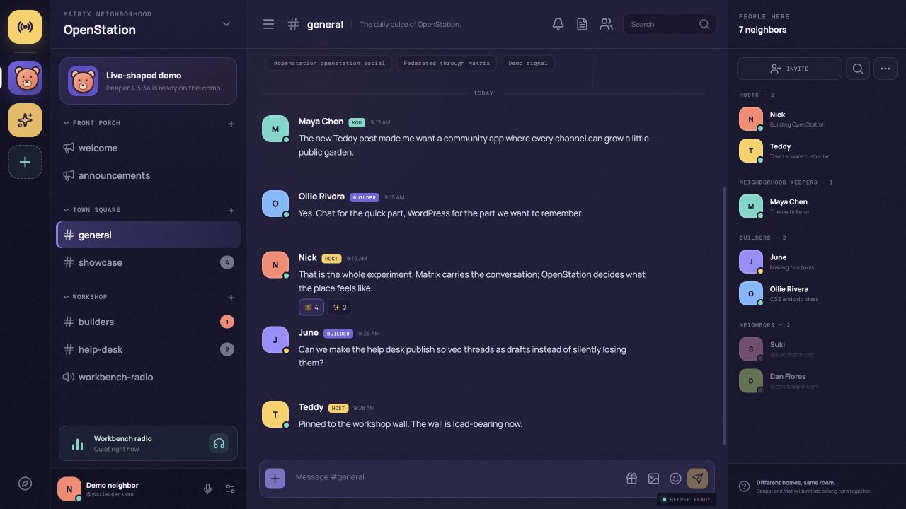

# OpenStation Neighborhoods

OpenStation Neighborhoods is a Discord-shaped web community carried by the Matrix account already inside Beeper Desktop. It gives OpenStation a warm, intentional gathering place without asking people to make another account or run another chat network.

The interface is an independent product that works with Beeper Desktop. Beeper is a third-party service and trademark; OpenStation does not operate or expose the Beeper API. See [`docs/BRANDING.md`](docs/BRANDING.md) for attribution and asset provenance.

The product lives at `openstation.chat`. It detects Beeper on `localhost`, connects through Beeper's OAuth flow, automatically joins the OpenStation rooms, reads their real messages, and sends messages and reactions through the Beeper Desktop API. No fictional chat or member data is shown when disconnected.



## What is here

- A responsive Discord-style interface with OpenStation/Teddy art direction
- A disconnected onboarding shell that never pretends sample content is live
- Automatic Beeper Desktop detection
- OAuth 2.0 dynamic client registration with PKCE
- A development-only manual access-token fallback
- Automatic Matrix room joining and discovery based on the community manifest
- Messages, reactions, unread badges, member lists, and send support
- Unit tests for room discovery, API normalization, and OAuth PKCE

## Run it

Requirements:

- Node.js 22.13 or newer
- Beeper Desktop 4.2.936 or newer for the live integration

```bash
npm install
npm run dev
```

Open [http://127.0.0.1:4176](http://127.0.0.1:4176). The app opens its Beeper connection panel and does not load chat data until the local OAuth connection is approved.

Build the static web bundle with:

```bash
npm run build
```

Publish an update to the claimed OpenStation SpaceFast space with:

```bash
npm run deploy:spacefast
```

See [`docs/DEPLOYMENT.md`](docs/DEPLOYMENT.md) for the `openstation.chat` custom-domain, Cloudflare DNS, and security setup.

Run the full project check with:

```bash
npm run check
```

## Connect Beeper

1. Keep Beeper Desktop open.
2. In Beeper, open **Settings → Integrations** and enable the Desktop API.
3. Open the connection panel in Neighborhoods.
4. Choose **Connect with Beeper** and approve the local read/write request Beeper shows.

OAuth access tokens are stored in `sessionStorage`, so closing the browser session clears the token. A stale or revoked token returns the app to a reconnectable authorization state. Neighborhoods never asks Beeper to listen beyond the loopback interface.

For development builds, **Use a manual token instead** accepts a token created in Beeper's integration settings. It is not part of the public member journey. Do not commit tokens to this repository or put them in Vite environment variables.

## The community manifest

The OpenStation community lives in [`src/community.ts`](src/community.ts). It describes Welcome, Announcements, General, Showcase, Builders, Help Desk, and Workbench Radio without exposing Matrix aliases in the product interface.

The rooms and Space are created once by an operator through the documented setup procedure. After provisioning, their immutable `!roomID:beeper.com` identifiers are stored in the manifest. Members authorize Beeper once and Neighborhoods joins those IDs automatically; the public product identity remains `openstation.chat`.

See [`docs/MATRIX_SETUP.md`](docs/MATRIX_SETUP.md) for the one-time Beeper provisioning and automatic member onboarding workflow.

## Architecture

```text
Neighborhoods UI
       │
       │ OAuth + HTTP on localhost
       ▼
Beeper Desktop API
       │
       │ the user's existing Matrix account
       ▼
OpenStation Matrix Space and rooms
```

The client uses serialized, visibility-aware HTTP synchronization for the selected room, with backoff when Beeper is unavailable. Beeper also exposes an experimental WebSocket API, but normal browser WebSockets cannot attach its required `Authorization` header, so the hosted client uses the documented HTTP endpoints.

## Deliberate limitations

- Room provisioning is not included in the production member bundle; operators use the separate setup and governance runbooks.
- Voice rooms are represented in the interface but are not implemented by the current Beeper Desktop API adapter.
- Search, notification controls, threads, uploads, voice, and member moderation are outside the current release-candidate scope.
- Room joining is automatic after Beeper authorization; the OpenStation Space and rooms still need one-time administrator provisioning.
- The hosted build still talks to Beeper on the visitor's own computer. It therefore requires Beeper Desktop to be running and the browser to grant local-network access; no OpenStation server receives the Beeper token.

## Project layout

- `src/community.ts` — canonical community and room manifest
- `src/beeper/` — local API client, response normalization, and OAuth
- `src/use-neighborhoods.ts` — disconnected/live state controller
- `src/components/` — the product interface
- `tests/` — Vitest unit tests

The code is licensed under GPL-2.0-or-later.
